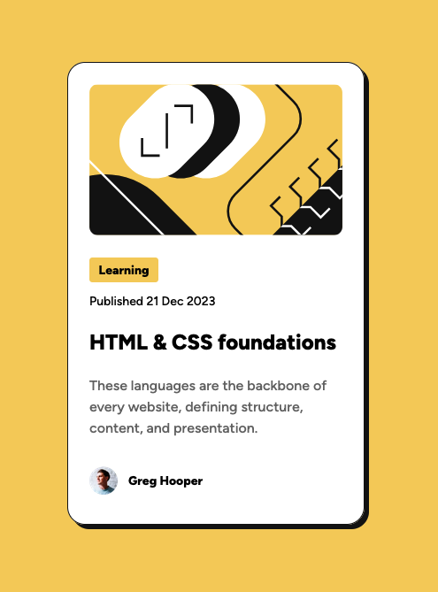

# Frontend Mentor - Blog preview card

This is a solution to the [Blog preview card challenge on Frontend Mentor](https://www.frontendmentor.io/challenges/blog-preview-card-ckPaj01IcS). Frontend Mentor challenges help you improve your coding skills by building realistic projects.

### Screenshot

### Links

- Solution URL: [Github repo](https://github.com)
- Live Site URL: [Solution Demo](https://github.com)

### Build with

- Semantic HTML5 markup
- CSS Flexbox

## Author

- WeL: [Github repo](https://github.com)
- Live Site URL: [Solution Demo](https://github.com)